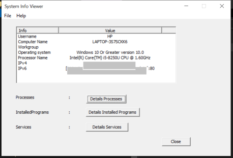
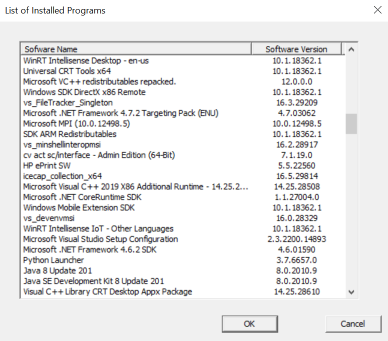
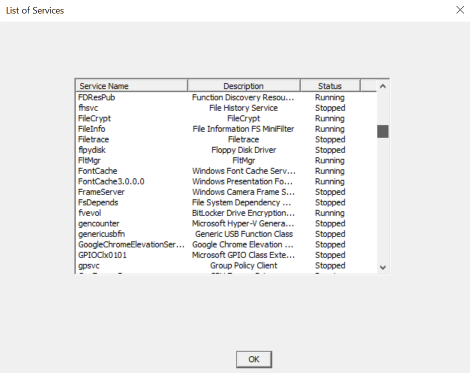

# SystemInfoViewer
C++ program with GUI (WTL) that collects and displays various system information

* [Computer name and workgroup/domain name](#general-info)
* [Processor type](#processor)
* [Operating system information](#os)
* [IPV4 and IPV6](#IP)
* [List of all running processes](#process)
* [List of of all installed programs](#program)
* [List of all installed services](#service)

